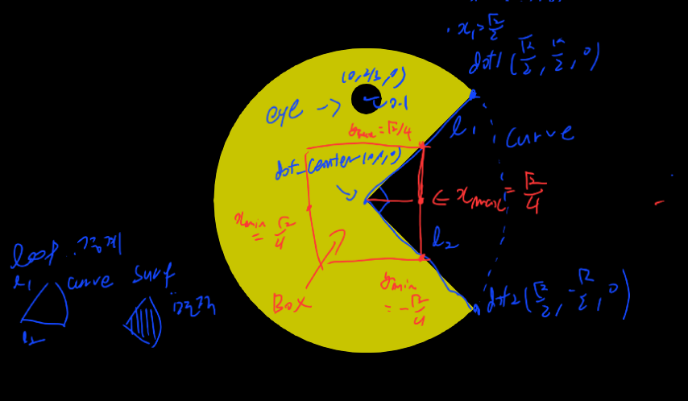
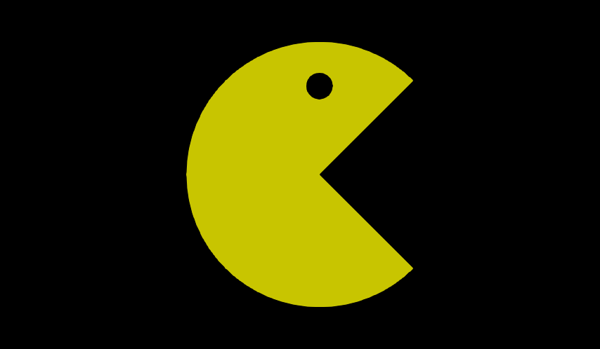
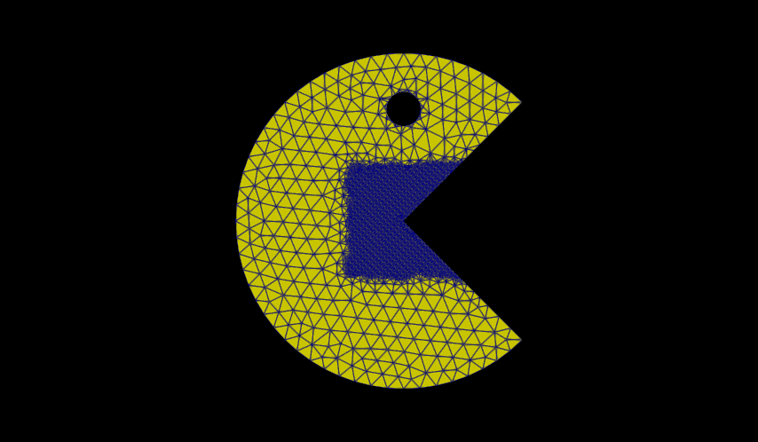

## Index

$\S$ 1. Concept

$\S$ 2. Create domain with gmsh API

$\S$ 3. Create domain with gmsh GUI

---

## $\S$ 1. Concept

---


### $\S$ 1.1 Pack man

{width=30%}

---

### $\S$ 1.2 Create order

1. Create unit disk.
2. Cut sector on disk.
3. Cut eye disk
4. Refine mesh around the mouth
5. Visualize

---

### $\S$ 1.3 Concept detail



---

## $\S$ 2 Create domain with gmsh API

---

### $\S$ 2.1 Create disks

- Create eye and face
- Use `gmsh.model.occ.addDisk(x,y,z,dx,dy)`

---

### $\S$ 2.2 Create sector
#### $\S$ 2.2.0 Define points

{width=20%}

- Add dots using create sector.
- Sector defined by three points.
- Use `gmsh.model.occ.addPoint(x,y,z)`

---

#### $\S$ 2.2.1 Define lines of sector

{width=20%}

- Make line by connect poits
- Using `gmsh.model.occ.addLIne(dot_centor,dot1)`

---

#### $\S$ 2.2.2 Define sector's boudary

{width=20%}

``` Python
loop=gmsh.model.occ.addCurveLoop([l1,curve,l2])
```

---

#### $\S$ 2.2.3 Defined sector plane

{width=20%}

```Python
surf=gmsh.model.occ.addPlaneSurface([loop])
```

---

### $\S$ 2.3 Cut eye and mout

- Using `gmsh.model.occ.cut([dim,index],[(dim,),(dim,),....])`
- Object - tool
- Object is disk.
- Tool is eye and mouth

---

### Result



---


### $\S$ 2.4 Create Mesh
#### $\S$ 2.4.0 Around the eye

- Create mesh densely around eye
- Eye have smaller radius than face. 
- So Eye's curcature is bigger than face.
- Use `gmsh.option.setNumber("Mesh.MeshSizeFromCurvature",N)`

---

#### $\S$ 2.4.1 Around the mouth 

- Set region.

- `gmsh.model.mesh.field.add("Box",tag)`

---

- Set Options

```Python
gmsh.model.mesh.field.setNumber(1,"VIn",0.01)
gmsh.model.mesh.field.setNumber(1,"VOut",0.1)
gmsh.model.mesh.field.setNumber(1,"XMin",-x1)
gmsh.model.mesh.field.setNumber(1,"XMax",x1)
gmsh.model.mesh.field.setNumber(1,"YMax",x1)
gmsh.model.mesh.field.setNumber(1,"YMin",-x1)
gmsh.model.mesh.field.setNumber(1,"ZMin",0)
gmsh.model.mesh.field.setNumber(1,"ZMax",0)
```

---

#### $\S$ 2.4.1.2 Mech create by distance


``` Py
distance = gmsh.model.mesh.field.add("Distance") 
gmsh.model.mesh.field.setNumbers( distance, "PointsList", [point_1, point_2] ) 
threshold = gmsh.model.mesh.field.add("Threshold") 
gmsh.model.mesh.field.setNumber(threshold, "InField", distance) 
gmsh.model.mesh.field.setNumber(threshold, "SizeMin", 0.01) 
gmsh.model.mesh.field.setNumber(threshold, "SizeMax", 0.10) 
gmsh.model.mesh.field.setNumber(threshold, "DistMin", 0.10) 
gmsh.model.mesh.field.setNumber(threshold, "DistMax", 0.50) 
gmsh.model.mesh.field.setAsBackgroundMesh(threshold)
```

- Calculate distance and make field.
- Threshold means 임계점..

---


- Order to use this field
- `gmsh.model.mesh.field.setAsBackgroundMesh(1)`

- Set PhysicalGroup 
- PhysicalGroup is not very important...
```Python
tags=[tags for dim,tags in packman]
gmsh.model.addPhysicalGroup(2,tags,2)
```

---

- result



---

## $\S$ 3 Create domain with gmsh GUI

and visualize demonstrate these live.

---
