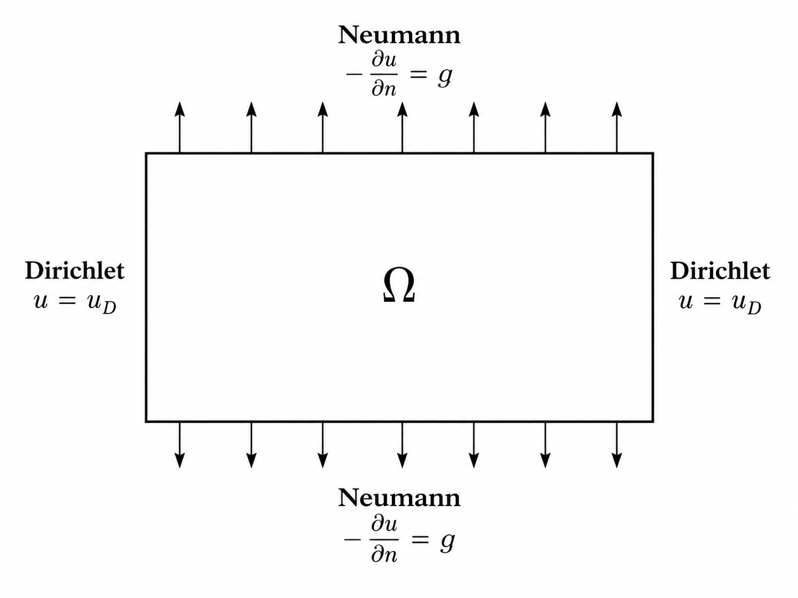

## 1. Problem Setup

{width=48%}

$$
-\nabla^2 u = f
\qquad \text{in } \Omega
$$

---

## Boundary Conditions

Dirichlet condition:

$$
u=u_D
\qquad \text{on } \Lambda_D
$$

Neumann condition:

$$
-\frac{\partial u}{\partial n}=g
\qquad \text{on } \Lambda_N
$$

---

## 2. Exact Solution

For verification, the exact solution is prescribed as

$$
u_D=1+x^2+2y^2
$$

This exact solution is used to determine

$$
f
\qquad \text{and} \qquad
g
$$

---

## Source Term

The source term is

$$
f=-\nabla^2u_D
$$

Since

$$
\nabla^2u_D=2+4=6
$$

we obtain

$$
f=-6
$$

---

## Normal Derivative

The normal derivative is defined as

$$
\frac{\partial u}{\partial n}
=
\nabla u\cdot\mathbf n
$$

For the exact solution,

$$
\nabla u_D=(2x,4y)
$$

---

## Neumann Condition: Bottom

At the bottom boundary,

$$
y=0,
\qquad
\mathbf n=(0,-1)
$$

Therefore,

$$
\frac{\partial u}{\partial n}=0
$$

and

$$
g=0
$$

---

## Neumann Condition: Top

At the top boundary,

$$
y=1,
\qquad
\mathbf n=(0,1)
$$

Therefore,

$$
\frac{\partial u}{\partial n}=4
$$

Since

$$
-\frac{\partial u}{\partial n}=g
$$

we obtain

$$
g=-4
$$

---

## Neumann Boundary Values

Therefore,

$$
g(x,y)=
\begin{cases}
0, & y=0,\\
-4, & y=1
\end{cases}
$$

In DOLFINx, this can be represented by

```python
x = SpatialCoordinate(mesh)
g = -4 * x[1]
```

---

## 3. Weak Form

Start from

$$
-\nabla^2u=f
$$

Multiply by the test function $v$:

$$
-\int_\Omega \nabla^2u\,v\,dx
=
\int_\Omega fv\,dx
$$

---

## Integration by Parts

Applying integration by parts gives

$$
\int_\Omega
\nabla u\cdot\nabla v\,dx
-
\int_{\partial\Omega}
\frac{\partial u}{\partial n}v\,ds
=
\int_\Omega fv\,dx
$$

The boundary condition enters through the second term.

---

## Dirichlet Boundary

For the test function,

$$
v=0
\qquad \text{on } \Lambda_D
$$

Therefore, the Dirichlet part of the boundary integral vanishes:

$$
\int_{\Lambda_D}
\frac{\partial u}{\partial n}v\,ds
=
0
$$

---

## Neumann Boundary

On the Neumann boundary,

$$
-\frac{\partial u}{\partial n}=g
$$

Therefore,

$$
-\int_{\Lambda_N}
\frac{\partial u}{\partial n}v\,ds
=
\int_{\Lambda_N}gv\,ds
$$

---

## Final Weak Form

The final weak form is

$$
\boxed{
\int_\Omega
\nabla u\cdot\nabla v\,dx
=
\int_\Omega fv\,dx
-
\int_{\Lambda_N}gv\,ds
}
$$

---

## 4. DOLFINx Implementation

The bilinear form is

```python
a = dot(grad(u), grad(v)) * dx
```

The linear form is

```python
L = f * v * dx - g * v * ds
```

---

## Dirichlet BC in DOLFINx

The Dirichlet condition is imposed directly:

```python
bc = dirichletbc(u_bc, dofs_D)
```

$$
u=u_D
\qquad \text{on } \Lambda_D
$$

This is a **strongly imposed boundary condition**.

---

## Neumann BC in DOLFINx

There is no separate `neumannbc()` function.

The Neumann condition appears in the weak form:

```python
L = f * v * dx - g * v * ds
```

$$
-\int_{\Lambda_N}gv\,ds
$$

is the contribution from the Neumann boundary.

---

## 5. Error Evaluation

The numerical solution uses linear elements:

$$
u_h\in P_1
$$

while the exact solution is quadratic:

$$
u_{\mathrm{exact}}
=
1+x^2+2y^2
$$

Therefore, the exact solution is represented using a higher-order space for the error calculation.

---

## $L^2$ Error

The $L^2$ error is

$$
\|u_h-u_{\mathrm{exact}}\|_{L^2}
=
\sqrt{
\int_\Omega
(u_h-u_{\mathrm{exact}})^2\,dx
}
$$

It measures the error over the entire domain.

---

## Maximum Nodal Error

The maximum error is also evaluated at the degrees of freedom:

$$
E_{\max}
=
\max_i
\left|
u_h(x_i)-u_{\mathrm{exact}}(x_i)
\right|
$$

This measures the error only at the nodal locations.

---

### output

Error_L2 : 5.27e-03
Error_max : 2.66e-15

---


## 6. Key Point

Dirichlet BC:

$$
u=u_D
$$

```python
dirichletbc(...)
```

Neumann BC:

$$
-\frac{\partial u}{\partial n}=g
$$

```python
-g * v * ds
```

---

## Summary

The two boundary conditions are handled differently.

$$
\boxed{
\text{Dirichlet}
\rightarrow
\text{imposed strongly}
}
$$

$$
\boxed{
\text{Neumann}
\rightarrow
\text{included in the weak form}
}
$$
