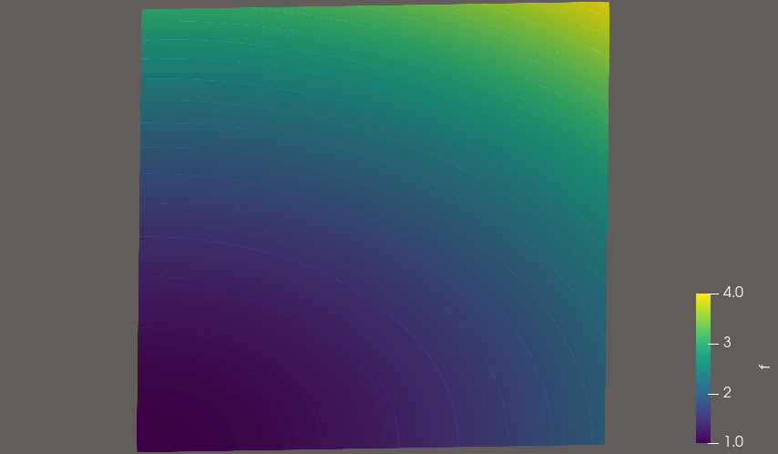
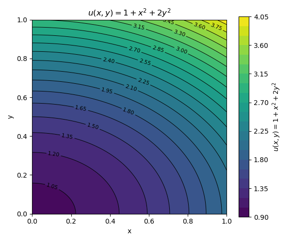

## Index

$\S$ 1.Proof Poisson equation

$\S$ 2.Comparison error

---

## $\S$ 1. Proof Poisson Equation

$$
\nabla ^2 u=-f \;\; (x,y) \in \Omega 
$$

$$
u=1+x^2+2y^2  \;\; (x,y) \in \partial \Omega
$$

- Analytic soluion is
  
$$
u=1+x^2+2y^2  
$$

$$
f=-6
$$

---

- Proof at same domain givne tutorial (unit square,64 element mesh)

- Give $P_1,P_2,P_3$ interpolate by loop

- Proof strong impostion and week impostion

---


### $\S$ 1.1 Proof Poisson Equation by Strong imposition

- Week formulation


$$
\begin{align}
\int_{\Omega} \nabla u \cdot \nabla v~\mathrm{d}x
\int_{\partial\Omega}\nabla u \cdot n v~\mathrm{d}s = \int_{\Omega} f v~\mathrm{d}x.
\end{align}
$$

- Test function $v \; \text{is} \;0 \; \text{on} \;\; \partial \Omega$

- Find boundary dofs and fix it as $u_D$

---

### $\S$ 1.2 Proof Poisoon Equation by week imposition(Nitche methode)

- Strong imposion is difficult when boundary change

- Week imposition is set boundary conditon on week formulation

- Can't set the trace test function is 0

---


$$
\begin{align}
\int_{\partial\Omega} \nabla  v \cdot n (u-u_D)~\mathrm{d}s
+\frac{\alpha}{h} \int_{\partial\Omega} (u-u_D)v~\mathrm{d}s.
\end{align}
$$


- So add these terms

- First term is enforce symmetry
- Last term is correctivity.. penalty term

- $u_D$ is known boundary condition
- $h$ is diameter of the circumscribed sphere of emsh element
- $\alpha$ is coefficent. $\alpha=CP^2$ 
C is emperical value. C=10 in this tutorial.
P is lagrange element degree.


---

### $\S$ 1.3 Visualization

- Strong imposition



---

- Weak impostion


---

- Analytic solution at matplotlib



---

## $\S$ 2. Error Comparison
### $\S$ 2.1 Error Define

$$
E=\sqrt{\int_\Omega (u_D-u_h)^2\mathrm{d} x}
$$

- Call $L^2$ error

---

- Advantage
    * Easy calculate
    * Easy study convergence rate
    * Most used error on FEM.
- Disadvantage
    * Can't proof local big error
    * Can't proof max error
    * No gradient error

---

### $\S$ 2.2 How to calculate

```Py
    uh=problem.solve()

    er=form((uh-uex)**2*dx)
    err=np.sqrt(assemble_scalar(er))
```

- Use `form()` to change ufl to fem
- `assemble_scalar()` assembles erros at whole domain 

---


### $\S$ 2.3 Result

- Error Comparison

| Lagrange Degree | Strong Dirichlet (L² Error) | Nitsche Method (L² Error) |
|:---------------:|----------------------------:|--------------------------:|
| P1 | 2.379174 × 10⁻¹ | 2.394297 × 10⁻¹ |
| P2 | 2.878808 × 10⁻⁵ | 4.181524 × 10⁻⁵ |
| P3 | 5.958940 × 10⁻⁵ | 5.196838 × 10⁻⁵ |


---

### $\S$ 2.4 Error discussion

- $P_1$ error is bigger than anoter.
    * Analytic solution is degree 2
    * $P_1$ can't represent it well

- $P_2, P_3$ error has on order $10^{-5}$ 
    * Over the degree 1, Error decrease
    * $P_2$ and $P_3$ error is similar.
      No improve accurancy increase element.

- $P_2$ error and $P_3$ error has numerical similar.
    * B.C. algorithm has small effect on error.


